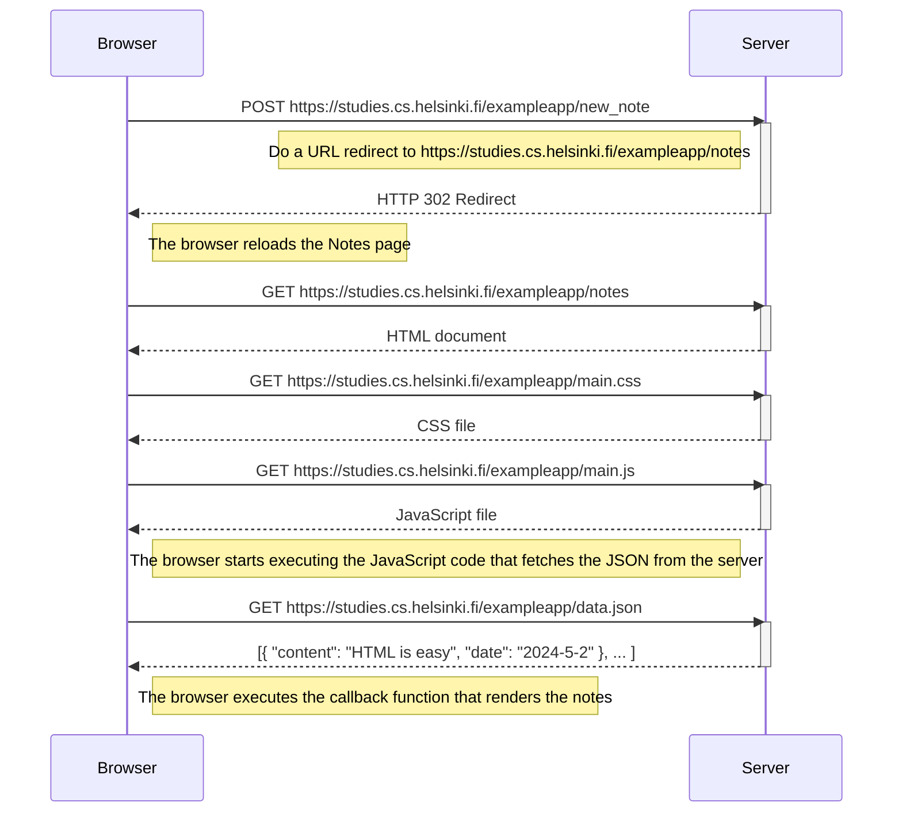

```mermaid

sequenceDiagram
participant Browser
participant Server

    Browser->>Server: POST https://studies.cs.helsinki.fi/exampleapp/new_note
    activate Server
    Note left of Server: Do a URL redirect to https://studies.cs.helsinki.fi/exampleapp/notes
    Server-->>Browser: HTTP 302 Redirect
    deactivate Server

    Note right of Browser: The browser reloads the Notes page

    Browser->>Server: GET https://studies.cs.helsinki.fi/exampleapp/notes
    activate Server
    Server-->>Browser: HTML document
    deactivate Server

    Browser->>Server: GET https://studies.cs.helsinki.fi/exampleapp/main.css
    activate Server
    Server-->>Browser: CSS file
    deactivate Server

    Browser->>Server: GET https://studies.cs.helsinki.fi/exampleapp/main.js
    activate Server
    Server-->>Browser: JavaScript file
    deactivate Server

    Note right of Browser: The browser starts executing the JavaScript code that fetches the JSON from the server

    Browser->>Server: GET https://studies.cs.helsinki.fi/exampleapp/data.json
    activate Server
    Server-->>Browser: [{ "content": "HTML is easy", "date": "2024-5-2" }, ... ]
    deactivate Server

    Note right of Browser: The browser executes the callback function that renders the notes
```
